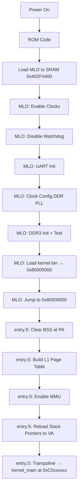

# 01 - Boot and Bring-up

> **Phạm vi:** Toàn bộ quá trình boot từ power-on đến khi `kernel_main()` được gọi — ROM → MLO → entry.S.
> **Yêu cầu trước:** Không có — đây là tài liệu đầu tiên cần đọc.
> **Files liên quan:** `bootloader/src/main.c`, `vinix-kernel/arch/arm/entry/entry.S`, `vinix-kernel/arch/arm/mm/mmu_enable.S`

---

## Hardware Context

| Thành Phần | Chi Tiết |
|------------|---------|
| Board | BeagleBone Black |
| SoC | Texas Instruments AM335x (Cortex-A8, ARMv7-A) |
| Boot Source | SD Card (MMC0) |
| Internal SRAM | 128 KB tại `0x402F0000` |
| DDR3 RAM | 512 MB tại `0x80000000` |

---

## Boot Flow Diagram



---

## Phase 1: ROM Boot

AM335x ROM code tự động:
1. Đọc boot configuration pins → xác định boot source (SD card)
2. Load file MLO từ SD card sector đầu tiên vào SRAM
3. Verify GP header (size, load address)
4. Jump to MLO entry point tại `0x402F0400`

> ⚠️ **Quan trọng:** ROM code chỉ load tối đa **128 KB** vào SRAM. Bootloader phải nhỏ gọn. Toàn bộ MLO phải fit vào giới hạn này.

---

## Phase 2: Bootloader (MLO)

File: `VinixOS/bootloader/src/main.c`

### Stage 0: Enable Essential Clocks

```c
writel(0x2, CM_PER_L4LS_CLKSTCTRL);  /* Enable L4LS clock */
writel(0x2, CM_PER_L3_CLKSTCTRL);    /* Enable L3 clock   */
writel(0x2, CM_PER_L4FW_CLKSTCTRL);  /* Enable L4FW clock */
delay(1000);
```

> **Tại sao:** Tất cả peripheral (UART, MMC, Timer) đều trên L4 bus. Phải enable clock **trước** khi access bất kỳ register nào — nếu không sẽ gây Data Abort.

### Stage 1: Disable Watchdog Timer

```c
writel(0xAAAA, WDT1_WSPR);
while (readl(WDT1_WWPS) != 0);   /* Đợi write pending clear */
writel(0x5555, WDT1_WSPR);
while (readl(WDT1_WWPS) != 0);
```

> **Tại sao:** ROM code enable watchdog với timeout ~3 phút. Nếu không disable, hệ thống sẽ tự reset trong quá trình boot.

> **Magic sequence:** Watchdog yêu cầu write `0xAAAA` rồi `0x5555` theo đúng thứ tự. Phải đợi WWPS (Write Pending Status) clear giữa 2 lần write.

### Stage 2–3: UART Init và Boot Banner

```c
uart_init();
delay(1000000);   /* UART stabilization delay */

uart_puts("========================================\r\n");
uart_puts("VinixOS Bootloader\r\n");
uart_puts("========================================\r\n");
```

**UART Configuration:**

| Parameter | Value |
|-----------|-------|
| Baudrate | 115200 |
| Format | 8N1 |
| Base address | `0x44E09000` (UART0, L4\_WKUP bus) |

> **Tại sao cần delay:** UART cần thời gian stabilize sau init. Không có delay sẽ mất ký tự đầu tiên output ra console.

### Stage 4: Clock Configuration

```c
clock_init();   /* Configure DDR PLL for 400MHz */
```

**DDR PLL Setup:**

| Parameter | Value |
|-----------|-------|
| Input | 24 MHz crystal oscillator |
| Multiplier M | 400 |
| Divider N | 23 |
| Output | 400 MHz cho DDR3 controller |

> **Lưu ý:** ROM code đã config MPU PLL (CPU clock). Bootloader chỉ cần config DDR PLL.

### Stage 5: DDR3 Initialization

```c
ddr_init();
if (ddr_test() != 0) {
    panic("DDR memory test FAILED!");
}
```

**DDR Configuration:**

| Parameter | Value |
|-----------|-------|
| Type | DDR3-800 (400 MHz) |
| Size | 512 MB |
| Base address | `0x80000000` |
| EMIF Controller | `0x4C000000` |

> **Memory test:** Write/read pattern để verify DDR hoạt động đúng **trước khi** load kernel vào đây.

### Stage 6: Load Kernel từ SD Card

```c
#define KERNEL_BASE_ADDR    0x80000000
#define KERNEL_START_SECTOR 2048        /* Offset 1MB trên SD card */
#define KERNEL_SIZE_SECTORS 2048        /* Max 1MB kernel           */

mmc_init();
mmc_read_sectors(KERNEL_START_SECTOR, KERNEL_SIZE_SECTORS,
                 (void *)KERNEL_BASE_ADDR);
```

**SD Card Layout:**

| Sector Range | Nội Dung |
|-------------|---------|
| 0 – 127 | MLO (bootloader) — 64 KB |
| 128 – 2047 | Reserved |
| 2048+ | `kernel.bin` (VinixOS kernel) |

> **Kernel load address:** `0x80000000` — đầu DDR3. Kernel được link để run tại địa chỉ này (và tại VA `0xC0000000` sau MMU enable).

### Stage 7: Boot Parameters

ARM Boot Protocol — truyền thông tin cho kernel qua registers:

| Register | Value | Ý Nghĩa |
|----------|-------|---------|
| r0 | 0 | Convention |
| r1 | `0x0E05` | Machine Type (BeagleBone Black) |
| r2 | ptr to `boot_params` | Struct chứa boot device, reset reason |

### Stage 8: Jump to Kernel

```c
/* Kernel magic check: byte đầu phải là ARM branch hoặc LDR PC */
uint32_t first = *(uint32_t *)0x80000000;
bool ok = ((first & 0xFF000000) == 0xEA000000) ||   /* B instruction */
          ((first & 0xFFFFF000) == 0xE59FF000);      /* LDR PC vector */
if (!ok) panic("Invalid kernel image!");

asm volatile(
    "mov r0, #0\n"
    "ldr r1, =0x0E05\n"
    "mov r2, %0\n"
    "ldr pc, =0x80000000\n"
    :: "r"(&params)
);
```

> **Kernel magic check:** Sanity check để tránh execute corrupt data. Byte đầu của một ARM kernel image hợp lệ phải là branch instruction.

---

## Phase 3: Kernel Entry — `entry.S`

File: `VinixOS/vinix-kernel/arch/arm/entry/entry.S`

Kernel entry point chạy tại Physical Address (PA) `0x80000000`, **MMU vẫn OFF**.

### Step 1: Clear BSS Section

```asm
ldr     r0, =_bss_start
sub     r0, r0, #VA_OFFSET_BOOT    /* VA → PA: subtract 0x40000000 */
ldr     r1, =_bss_end
sub     r1, r1, #VA_OFFSET_BOOT
mov     r2, #0

1:  cmp     r0, r1
    strlo   r2, [r0], #4
    blo     1b
```

> **Tại sao:** Linker symbols (`_bss_start`, `_bss_end`) là Virtual Address `0xC0xxxxxx`, nhưng MMU chưa enable → phải subtract `VA_OFFSET (0x40000000)` để có PA. C standard yêu cầu zero-init BSS trước bất kỳ C code nào.

### Step 2: Build Page Table

```asm
ldr     r0, =_pgd_start
sub     r0, r0, #VA_OFFSET_BOOT    /* pgd PA */
bl      mmu_build_page_table_boot  /* C function trong .text.boot_entry */
```

`mmu_build_page_table_boot()` tạo L1 page table với 4 mappings:

| Mapping | VA | → PA | Mục Đích |
|---------|----|----|---------|
| Identity (temporary) | `0x80000000` | `0x80000000` | CPU tiếp tục execute sau MMU enable |
| Kernel high | `0xC0000000` | `0x80000000` | Permanent kernel space |
| User space | `0x40000000` | `0x80000000` | User apps |
| Peripherals | identity | identity | UART, INTC, Timer |

### Step 3: Enable MMU

```asm
ldr     r0, =_pgd_start
sub     r0, r0, #VA_OFFSET_BOOT
bl      mmu_enable
```

`mmu_enable()` thực hiện:
1. Write page table base → TTBR0 (`CP15 c2`)
2. Set Domain Access Control → DACR (`CP15 c3`)
3. Set MMU enable bit → SCTLR (`CP15 c1`, bit 0)
4. `ISB` barrier

> ⚠️ **Quan trọng:** Sau khi MMU enable, CPU vẫn đang execute tại **PA** (qua identity mapping). Cần trampoline ở Step 5 để nhảy sang VA.

### Step 4: Reload Stack Pointers

```asm
cps     #0x11 ; ldr sp, =_fiq_stack_top    /* FIQ mode */
cps     #0x12 ; ldr sp, =_irq_stack_top    /* IRQ mode */
cps     #0x17 ; ldr sp, =_abt_stack_top    /* ABT mode */
cps     #0x1B ; ldr sp, =_und_stack_top    /* UND mode */
cps     #0x13 ; ldr sp, =_svc_stack_top    /* SVC mode */
```

> **Tại sao:** Stack pointers init bởi bootloader tại PA. Sau enable MMU phải reload về VA để tránh stack corruption khi identity mapping bị remove. Mỗi ARM exception mode có SP riêng (banked registers).

### Step 5: Trampoline to High VA

```asm
ldr     pc, =kernel_main   /* Load VA 0xC0xxxxxx vào PC */
```

**Cơ chế trampoline:**

```
ldr pc, =kernel_main
    ↓ compile thành: ldr pc, [pc, #offset]
    ↓ literal pool chứa 0xC0xxxxxx (trong .text.boot_entry — accessible qua identity map)
    ↓ CPU load 0xC0xxxxxx vào PC
    ↓ CPU fetch instruction tiếp theo từ VA 0xC0xxxxxx (qua high mapping)
    ↓ Từ đây CODE CHẠY HOÀN TOÀN TẠI VA
```

> Identity mapping vẫn còn active sau trampoline. Sẽ bị remove bởi `mmu_init()` trong `kernel_main()`.

---

## Memory Map Evolution

### Tại Bootloader Stage (MMU OFF)

```
Physical = Virtual (không có MMU):
0x402F0400  MLO (đang chạy tại đây)
0x80000000  Kernel image vừa load
0x44E09000  UART0
```

### Sau MMU Enable — entry.S (Before Trampoline)

| VA Range | → PA | Loại |
|----------|------|------|
| `0x40000000–0x40FFFFFF` | `0x80000000` | User space (16 MB) |
| `0x80000000–0x87FFFFFF` | `0x80000000` | **Identity map (TEMPORARY)** |
| `0xC0000000–0xC7FFFFFF` | `0x80000000` | Kernel space (128 MB) |
| `0x44E00000–0x44E0FFFF` | identity | L4\_WKUP peripherals |
| `0x48000000–0x482FFFFF` | identity | L4\_PER peripherals |

### Sau `mmu_init()` trong `kernel_main()`

| VA Range | → PA | Thay Đổi |
|----------|------|---------|
| `0x80000000–0x87FFFFFF` | — | **REMOVED** → Translation Fault |
| Còn lại | không đổi | — |

---

## Tóm Tắt

| Concept | Ý Nghĩa |
|---------|---------|
| Two-stage boot | ROM → MLO → Kernel. Mỗi stage có trách nhiệm riêng; ROM chỉ load 128 KB |
| Hardware init sequence | Clocks → Watchdog → UART → DDR. Sai thứ tự = Data Abort |
| MMU trampoline | Enable MMU với identity + high mapping → jump sang VA → remove identity map |
| PA vs VA awareness | Trước MMU enable dùng PA; sau đó dùng VA. Code phải rõ ràng về context |
| Stack reload | Sau enable MMU phải reload tất cả SPs về VA (6 exception mode stacks) |
| Boot verification | Check kernel magic trước jump để tránh execute corrupt data |

---

## Xem Thêm

- [02-kernel-initialization.md](02-kernel-initialization.md) — tiếp tục từ `kernel_main()` trở đi
- [03-memory-and-mmu.md](03-memory-and-mmu.md) — chi tiết về page table và address translation
