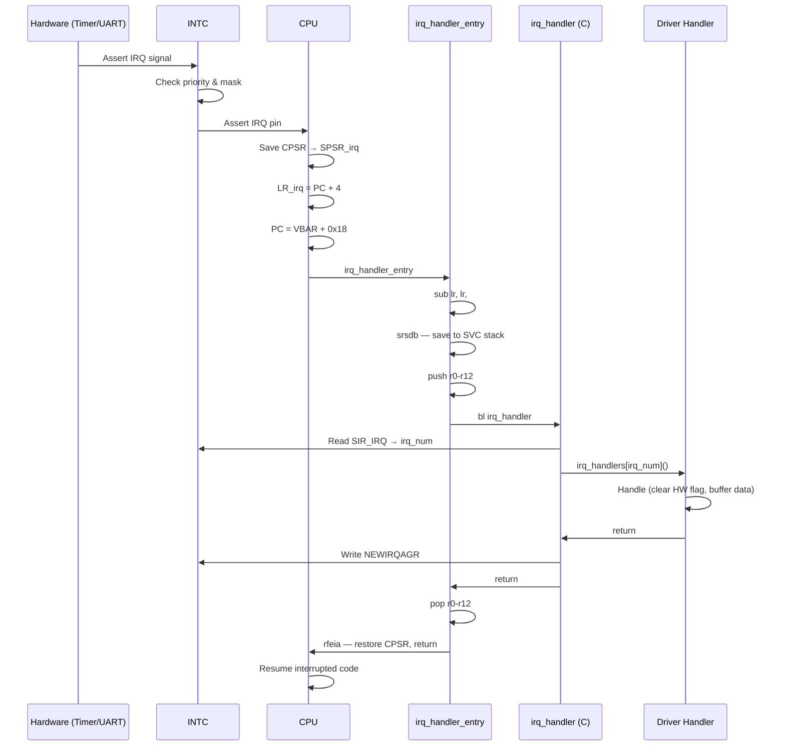

# 04 - Interrupt and Exception Handling

> **Phạm vi:** ARMv7-A exception model, vector table, INTC configuration, và complete IRQ flow từ hardware đến handler.
> **Yêu cầu trước:** [03-memory-and-mmu.md](03-memory-and-mmu.md) — VBAR phụ thuộc MMU; [02-kernel-initialization.md](02-kernel-initialization.md) — thứ tự init INTC/IRQ.
> **Files liên quan:** `kernel/src/arch/arm/entry/entry.S`, `kernel/src/arch/arm/exceptions/`, `kernel/src/kernel/exceptions/exception_handlers.c`, `kernel/src/drivers/intc.c`, `kernel/src/kernel/irq/irq_core.c`

---

## ARMv7-A Exception Model

### Exception Types

| Exception | Vector Offset | Mode Chuyển Sang | Priority |
|-----------|--------------|-----------------|---------|
| Reset | `0x00` | SVC | 1 (highest) |
| Undefined Instruction | `0x04` | UND | 6 |
| SVC (System Call) | `0x08` | SVC | 6 |
| Prefetch Abort | `0x0C` | ABT | 5 |
| Data Abort | `0x10` | ABT | 5 |
| Reserved | `0x14` | — | — |
| IRQ | `0x18` | IRQ | 4 |
| FIQ | `0x1C` | FIQ | 2 |

**Priority:** Reset > FIQ > IRQ > Abort > Undefined/SVC

### Hardware Exception Entry (Tự Động)

Khi exception xảy ra, CPU **tự động** thực hiện (không cần software):

1. Save `CPSR` → `SPSR_<mode>`
2. Switch sang exception mode
3. Set I-bit (disable IRQ)
4. Save return address → `LR_<mode>`
5. `PC = VBAR + vector_offset`

> ⚠️ **CPU KHÔNG save r0-r12.** Exception handler phải tự save/restore general-purpose registers.

---

## Vector Table

File: `VinixOS/vinix-kernel/src/arch/arm/entry/entry.S`

```asm
.section .text.vectors, "ax"
.align 5
.global vector_table

vector_table:
    ldr pc, =reset_handler           /* 0x00: Reset          */
    ldr pc, =undefined_handler       /* 0x04: Undefined Instr */
    ldr pc, =svc_handler_entry       /* 0x08: SVC            */
    ldr pc, =prefetch_abort_handler  /* 0x0C: Prefetch Abort  */
    ldr pc, =data_abort_handler      /* 0x10: Data Abort      */
    nop                              /* 0x14: Reserved        */
    ldr pc, =irq_handler_entry       /* 0x18: IRQ            */
    ldr pc, =fiq_handler             /* 0x1C: FIQ            */
```

**Vector Table Location:**

| Phase | Address | Lý Do |
|-------|---------|-------|
| Trước `mmu_init()` | PA `0x80000000` | VBAR không đổi, dùng PA |
| Sau `mmu_init()` | VA `0xC0000000` | VBAR update → VA trong `mmu_init()` |

> **`ldr pc, =handler` pattern:** Load handler address từ literal pool → jump. Cho phép handler ở bất kỳ đâu trong 4 GB address space.

---

## Exception Handlers

### 1. Undefined Instruction

```c
void c_undef_handler(void) {
    uint32_t ifsr, ifar;
    asm volatile("mrc p15, 0, %0, c5, c0, 1" : "=r"(ifsr));  /* IFSR */
    asm volatile("mrc p15, 0, %0, c6, c0, 2" : "=r"(ifar));  /* IFAR */

    uart_printf("PANIC: UNDEFINED INSTRUCTION!\n");
    uart_printf("IFAR (Fault PC): 0x%08x\n", ifar);
    uart_printf("IFSR (Status):   0x%08x\n", ifsr);

    struct task_struct *current = scheduler_current_task();
    if (current) scheduler_terminate_task(current->id);
    while (1);
}
```

**Causes:** Execute invalid instruction, Thumb/ARM mode mismatch.

**CP15 diagnostic registers:**

| Register | CP15 Address | Nội Dung |
|----------|-------------|---------|
| IFSR | `c5, c0, 1` | Instruction Fault Status |
| IFAR | `c6, c0, 2` | PC của instruction gây lỗi |

### 2. Data Abort

```c
void c_data_abort_handler(void) {
    uint32_t dfsr, dfar;
    asm volatile("mrc p15, 0, %0, c5, c0, 0" : "=r"(dfsr));
    asm volatile("mrc p15, 0, %0, c6, c0, 0" : "=r"(dfar));

    uart_printf("PANIC: DATA ABORT!\n");
    uart_printf("DFAR (Fault Address): 0x%08x\n", dfar);
    uart_printf("DFSR (Status):        0x%08x\n", dfsr);

    /* Decode fault type từ DFSR */
    uint32_t fs = (dfsr & 0xF) | ((dfsr & 0x400) >> 6);
    if (fs == 0x05 || fs == 0x07)
        uart_printf("Translation Fault (unmapped VA)\n");
    else if (fs == 0x0D || fs == 0x0F)
        uart_printf("Permission Fault (AP violation)\n");

    struct task_struct *current = scheduler_current_task();
    if (current) scheduler_terminate_task(current->id);
    while (1);
}
```

**Fault types (DFSR field FS[4:0]):**

| Fault Type | Mã FS | Nguyên Nhân |
|-----------|-------|------------|
| Translation Fault | `0x05/0x07` | Access unmapped VA (PGD entry = 0) |
| Permission Fault | `0x0D/0x0F` | User mode access kernel-only region |
| Alignment Fault | `0x01` | Unaligned access (nếu enabled) |

**CP15 diagnostic registers:**

| Register | CP15 Address | Nội Dung |
|----------|-------------|---------|
| DFSR | `c5, c0, 0` | Data Fault Status |
| DFAR | `c6, c0, 0` | VA gây ra fault |

### 3. SVC (System Call)

File: `kernel/src/arch/arm/exceptions/exception_entry.S`

```asm
svc_handler_entry:
    sub     lr, lr, #0              /* LR đã point đến return address */
    srsdb   sp!, #0x13              /* Save LR_svc + SPSR_svc lên SVC stack */
    push    {r0-r12, lr}            /* Save all general registers */

    mov     r0, sp                  /* r0 = pointer đến saved context */
    bl      svc_handler             /* Call C handler */

    pop     {r0-r12, lr}
    rfeia   sp!                     /* Restore SPSR → CPSR và return */
```

**`srsdb`** = Store Return State Decrement Before — save `LR` và `SPSR` vào SVC stack.
**`rfeia`** = Return From Exception Increment After — restore `SPSR → CPSR` và jump `LR`.

### 4. IRQ

```asm
irq_handler_entry:
    sub     lr, lr, #4              /* Adjust: IRQ LR = next instr + 4 */
    srsdb   sp!, #0x13              /* Save vào SVC stack (không phải IRQ stack!) */
    cps     #0x13                   /* Switch sang SVC mode */
    push    {r0-r12, lr}

    bl      irq_handler

    pop     {r0-r12, lr}
    rfeia   sp!
```

> **LR adjustment:** Khi IRQ xảy ra, `LR_irq = PC_interrupted + 4`. Subtract 4 để return address chỉ đúng instruction bị interrupted.

> ⚠️ **Save context lên SVC stack (không phải IRQ stack):** Context switch (`scheduler_yield()`) cần đọc/ghi SVC stack frame. Nếu save lên IRQ stack, context switch sẽ không work.

---

## Interrupt Controller (INTC)

AM335x INTC — centralized interrupt controller route 128 interrupt sources đến CPU.

```
128 Peripheral IRQ sources (Timer, UART, GPIO, ...)
    ↓
INTC (Priority, Masking, Routing)
    ↓
CPU IRQ/FIQ pins
```

### INTC Initialization

File: `kernel/src/drivers/intc.c`

```c
void intc_init(void) {
    /* Soft reset */
    writel(0x2, INTC_SYSCONFIG);
    while (!(readl(INTC_SYSSTATUS) & 0x1));  /* Wait reset complete */

    /* Mask tất cả 128 interrupts (4 registers × 32 bits) */
    for (int i = 0; i < 4; i++)
        writel(0xFFFFFFFF, INTC_MIR_SET(i));

    /* Priority threshold: 0xFF = allow all priorities */
    writel(0xFF, INTC_THRESHOLD);

    /* Acknowledge any pending */
    writel(0x1, INTC_CONTROL);  /* NEWIRQAGR */
}
```

### Enable Specific Interrupt

```c
void intc_enable_interrupt(uint32_t irq_num, uint32_t priority) {
    /* Set priority (0 = highest, 127 = lowest) */
    writel(priority, INTC_ILR(irq_num));

    /* Unmask interrupt: MIR_CLEAR bit set = enable */
    uint32_t reg = irq_num / 32;
    uint32_t bit = irq_num % 32;
    writel(1 << bit, INTC_MIR_CLEAR(reg));
}
```

**Key INTC IRQ numbers:**

| IRQ# | Source | Dùng Cho |
|------|--------|---------|
| 68 | DMTimer2 | Scheduler tick (10ms) |
| 72 | UART0 | RX character input |

---

## IRQ Handler Registration

File: `kernel/src/kernel/irq/irq_core.c`

```c
#define MAX_IRQS 128
static irq_handler_t irq_handlers[MAX_IRQS];

void irq_init(void) {
    for (int i = 0; i < MAX_IRQS; i++)
        irq_handlers[i] = NULL;
}

int irq_register_handler(uint32_t irq_num, irq_handler_t handler) {
    if (irq_num >= MAX_IRQS) return -1;
    irq_handlers[irq_num] = handler;
    return 0;
}
```

**C-level IRQ dispatcher:**

```c
void irq_handler(void) {
    /* Read active IRQ number từ INTC */
    uint32_t irq_num = readl(INTC_SIR_IRQ) & 0x7F;

    if (irq_handlers[irq_num])
        irq_handlers[irq_num]();

    /* Acknowledge: cho phép INTC forward interrupt tiếp theo */
    writel(0x1, INTC_CONTROL);  /* NEWIRQAGR */
}
```

> ⚠️ **NEWIRQAGR phải write sau mỗi IRQ handler:** Nếu không acknowledge, INTC sẽ không forward interrupt tiếp theo — system trở nên không responsive.

---

## Complete IRQ Flow



---

## Nested Interrupts

VinixOS **KHÔNG** support nested interrupts.

> **Rationale:** Đơn giản — không cần nested stack management, tránh stack overflow. Đủ cho reference OS. IRQ handler không re-enable IRQ (I-bit vẫn set). Interrupts chỉ re-enable khi return về task context qua `rfeia`.

---

## Tóm Tắt

| Concept | Ý Nghĩa |
|---------|---------|
| Exception = Mode Switch | Mỗi exception switch sang mode riêng với SP, LR, SPSR độc lập |
| Hardware saves minimal | CPU chỉ save CPSR và LR; handler phải save r0-r12 |
| INTC centralizes routing | 128 sources → priority + mask → CPU IRQ pin |
| LR adjustment (-4) | IRQ LR = PC+4; phải subtract để return đúng instruction |
| Save to SVC stack | Cho phép context switch work từ IRQ context |
| NEWIRQAGR bắt buộc | Acknowledge mỗi IRQ, nếu không INTC block interrupt tiếp theo |
| No nested interrupts | I-bit không clear trong handler — đơn giản và safe |

---

## Xem Thêm

- [05-task-and-scheduler.md](05-task-and-scheduler.md) — timer IRQ trigger scheduler tick
- [06-syscall-mechanism.md](06-syscall-mechanism.md) — SVC exception flow chi tiết
- [02-kernel-initialization.md](02-kernel-initialization.md) — thứ tự init: intc → irq → timer
