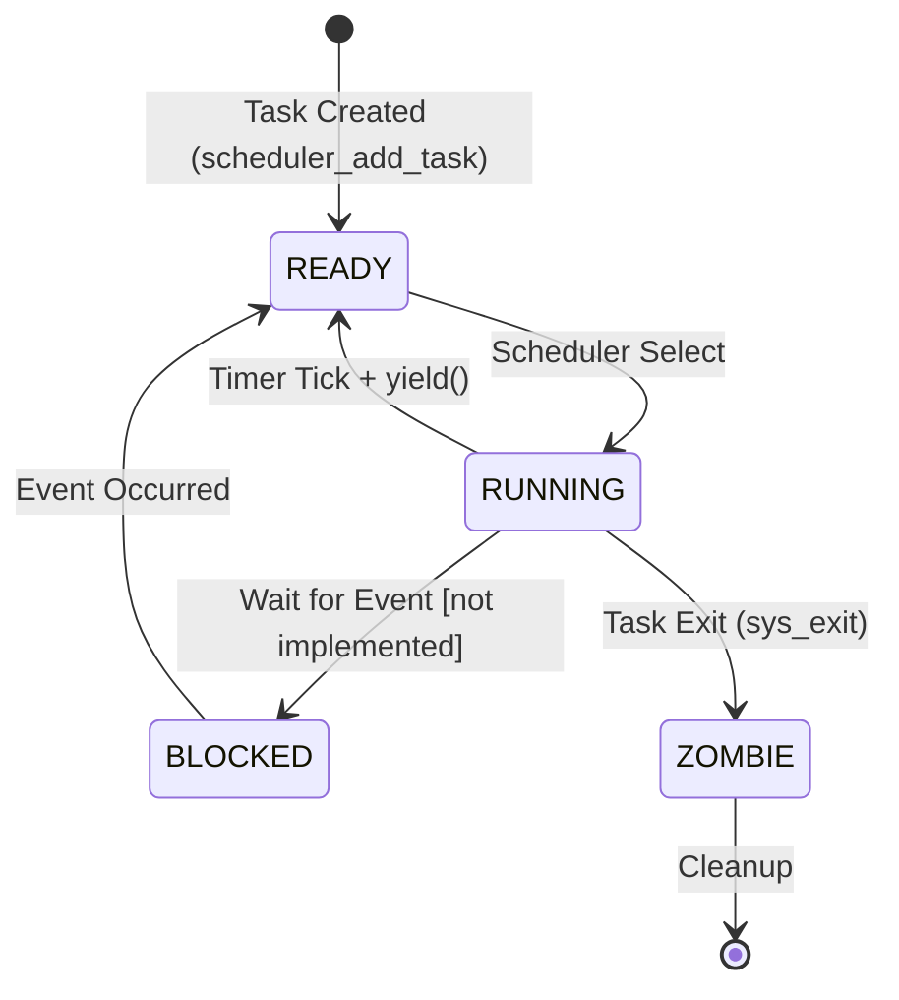
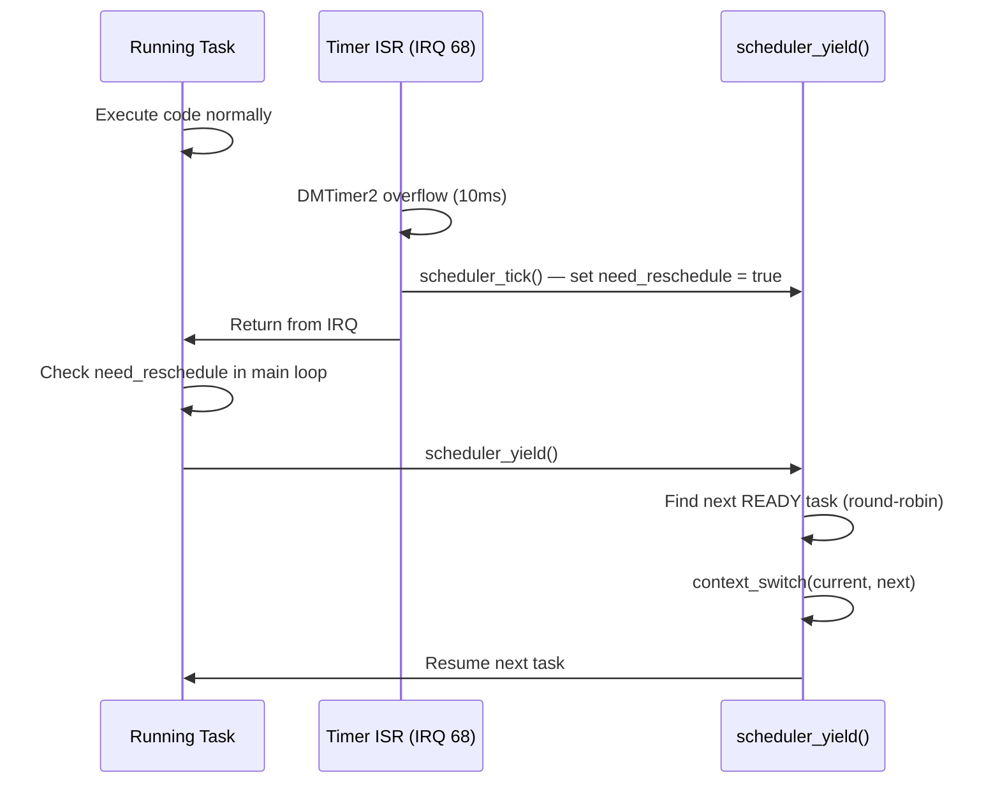

# 05 - Task and Scheduler

> **Phạm vi:** Task structure, context switch mechanism, round-robin preemptive scheduler, và timer configuration.
> **Yêu cầu trước:** [04-interrupt-and-exception.md](04-interrupt-and-exception.md) — timer IRQ là trigger của scheduler.
> **Files liên quan:** `vinix-kernel/include/task.h`, `vinix-kernel/kernel/sched/`, `vinix-kernel/arch/arm/scheduler/context_switch.S`, `vinix-kernel/drivers/clocksource/timer-omap-dm.c`

---

## Task Structure

File: `VinixOS/vinix-kernel/include/task.h`

```c
struct task_context {
    uint32_t r0, r1, r2, r3, r4, r5, r6;   /* 28 bytes */
    uint32_t r7, r8, r9, r10, r11, r12;     /* 24 bytes */
    uint32_t sp;      /* r13_svc — SVC mode stack pointer */
    uint32_t lr;      /* r14_svc — SVC mode link register */
    uint32_t spsr;    /* Saved Program Status Register     */
    uint32_t sp_usr;  /* r13_usr — User mode stack pointer */
    uint32_t lr_usr;  /* r14_usr — User mode link register */
    /* Total: 72 bytes */
};

struct task_struct {
    struct task_context context;  /* Saved CPU state (72 bytes)  */
    void    *stack_base;          /* Stack bottom (high address)  */
    uint32_t stack_size;          /* Stack size in bytes          */
    uint32_t state;               /* READY / RUNNING / BLOCKED / ZOMBIE */
    const char *name;             /* Human-readable task name     */
    uint32_t id;                  /* Unique task ID               */
};
```

**Task States:**

| State | Value | Ý Nghĩa |
|-------|-------|---------|
| READY | 0 | Sẵn sàng chạy, đang chờ scheduler |
| RUNNING | 1 | Đang chiếm CPU |
| BLOCKED | 2 | Đang chờ event (chưa implement) |
| ZOMBIE | 3 | Task đã exit, chờ cleanup |

---

## Task Stack Initialization

File: `vinix-kernel/kernel/sched/task.c`

```c
void task_stack_init(struct task_struct *task,
                     void (*entry_point)(void),
                     void *stack_base,
                     uint32_t stack_size)
{
    /* Stack canary tại đáy stack để detect overflow */
    uint32_t *sp = (uint32_t *)((uint32_t)stack_base - stack_size);
    *sp = 0xDEADBEEF;   /* STACK_CANARY_VALUE */

    memset(&task->context, 0, sizeof(struct task_context));

    /* Entry point: context switch sẽ jump đến đây lần đầu */
    task->context.lr = (uint32_t)entry_point;

    /* Initial CPSR theo loại task */
    if ((uint32_t)entry_point >= USER_SPACE_VA) {
        task->context.spsr  = 0x10;              /* User mode, IRQ enabled */
        task->context.sp_usr = (uint32_t)stack_base;  /* User stack top */
    } else {
        task->context.spsr  = 0x13;              /* SVC mode, IRQ enabled  */
    }

    task->context.sp   = (uint32_t)sp;
    task->stack_base   = stack_base;
    task->stack_size   = stack_size;
}
```

> **Cơ chế first-run:** Khi `context_switch()` load task lần đầu tiên, nó restore `LR = entry_point` và `SPSR = mode bits`. Instruction `movs pc, lr` restore CPSR từ SPSR và jump đến entry point — task bắt đầu execute đúng mode.

> **Stack Canary (`0xDEADBEEF`):** Đặt tại đáy stack. Trước mỗi context switch, scheduler check canary — nếu bị overwrite → stack overflow detected → PANIC.

**SPSR mode bits:**

| Mode | SPSR value | Dùng Cho |
|------|-----------|---------|
| User | `0x10` | Shell task (restricted access) |
| SVC | `0x13` | Idle task (kernel mode) |

---

## Context Switch

File: `vinix-kernel/arch/arm/scheduler/context_switch.S`

```asm
.global context_switch
context_switch:
    /* r0 = &current_task->context (save here) */
    /* r1 = &next_task->context (load from here) */

    /* --- Save current task context --- */
    stmia   r0, {r0-r12}        /* Save r0-r12 (52 bytes) */
    add     r0, r0, #52
    str     sp, [r0], #4        /* Save SP_svc */
    str     lr, [r0], #4        /* Save LR_svc */
    mrs     r2, spsr
    str     r2, [r0], #4        /* Save SPSR   */

    /* Save User mode SP và LR (banked registers) */
    cps     #0x10               /* Switch to User mode */
    mov     r2, sp
    mov     r3, lr
    cps     #0x13               /* Back to SVC mode    */
    str     r2, [r0], #4        /* Save SP_usr */
    str     r3, [r0]            /* Save LR_usr */

    /* --- Load next task context --- */
    ldmia   r1, {r0-r12}        /* Restore r0-r12 */
    add     r1, r1, #52
    ldr     sp, [r1], #4        /* Restore SP_svc */
    ldr     lr, [r1], #4        /* Restore LR_svc */
    ldr     r2, [r1], #4
    msr     spsr, r2            /* Restore SPSR   */

    ldr     r2, [r1], #4
    ldr     r3, [r1]
    cps     #0x10               /* Switch to User mode */
    mov     sp, r2              /* Restore SP_usr */
    mov     lr, r3              /* Restore LR_usr */
    cps     #0x13               /* Back to SVC mode */

    movs    pc, lr              /* Restore CPSR từ SPSR và jump LR */
```

**Key instructions:**

| Instruction | Ý Nghĩa |
|-------------|---------|
| `stmia r0, {r0-r12}` | Store Multiple — save 13 registers trong 1 instruction |
| `ldmia r1, {r0-r12}` | Load Multiple — restore 13 registers trong 1 instruction |
| `cps #0x10` | Change Processor State → User mode để access banked SP/LR |
| `movs pc, lr` | Copy `SPSR → CPSR` và `LR → PC` — return từ exception + switch mode |

> **Tại sao phải switch mode để save SP\_usr/LR\_usr:** SP và LR là **banked registers** — mỗi ARM mode có SP/LR riêng. Phải switch sang User mode để access `SP_usr` và `LR_usr`.

---

## Scheduler Implementation

File: `vinix-kernel/kernel/sched/scheduler.c`

### Data Structures

```c
#define MAX_TASKS 4

static struct task_struct *tasks[MAX_TASKS];
static uint32_t           task_count         = 0;
static struct task_struct *current_task      = NULL;
static uint32_t           current_task_index = 0;
static bool               scheduler_started  = false;

volatile bool need_reschedule = false;
```

### Scheduler Tick (Timer ISR Context)

```c
void scheduler_tick(void) {
    if (!scheduler_started) return;
    need_reschedule = true;   /* Chỉ set flag — không switch trong ISR */
}
```

> ⚠️ **Không context switch trong ISR:** IRQ mode có stack nhỏ và riêng biệt. Context switch cần SVC mode stack. Unsafe để switch trong nested exception context. Giải pháp: set flag, tasks tự check và yield.

### Scheduler Yield (Task Context)

```c
void scheduler_yield(void) {
    if (!need_reschedule) return;
    need_reschedule = false;

    /* Stack canary check */
    uint32_t *canary = (uint32_t *)((uint32_t)current_task->stack_base
                                    - current_task->stack_size);
    if (*canary != 0xDEADBEEF)
        PANIC("Stack overflow detected!");

    /* Round-robin: tìm task READY tiếp theo */
    uint32_t next_index = current_task_index;
    struct task_struct *next_task = current_task;

    for (int i = 0; i < MAX_TASKS; i++) {
        next_index = (next_index + 1) % MAX_TASKS;
        if (tasks[next_index] &&
            tasks[next_index]->state == TASK_STATE_READY) {
            next_task = tasks[next_index];
            break;
        }
    }

    /* Update states */
    if (current_task->state != TASK_STATE_ZOMBIE)
        current_task->state = TASK_STATE_READY;
    next_task->state = TASK_STATE_RUNNING;

    /* Perform context switch */
    struct task_struct *prev = current_task;
    current_task       = next_task;
    current_task_index = next_index;
    context_switch(prev, next_task);
}
```

---

## Task State Machine



## Preemption Flow



---

## Tasks trong VinixOS

### Idle Task (Kernel Mode)

```c
void idle_task(void) {
    while (1) {
        extern volatile bool need_reschedule;
        if (need_reschedule)
            scheduler_yield();
        asm volatile("nop");    /* CPU idle */
    }
}
```

| Property | Value |
|----------|-------|
| Mode | SVC (`CPSR = 0x13`) |
| Priority | Lowest (luôn READY, never blocks) |
| Stack | Kernel SVC stack |
| Mục đích | Chạy khi không có task nào khác READY |

### Shell Task (User Mode)

| Property | Value |
|----------|-------|
| Mode | User (`CPSR = 0x10`) |
| Entry point | `0x40000000` (shell.bin đã copy vào đây) |
| Stack | `0x40100000 - 4KB` |
| I/O | Via syscalls (SVC #0) |

---

## Timer Configuration

File: `vinix-kernel/drivers/clocksource/timer-omap-dm.c`

```c
#define TIMER_FREQ_HZ 100   /* 100 Hz = 10ms per tick */

void timer_init(void) {
    /* Enable DMTimer2 clock */
    writel(0x2, CM_PER_TIMER2_CLKCTRL);

    /* Stop timer */
    writel(0, DMTIMER2_TCLR);

    /* Reload value cho 10ms @ 24MHz clock:
     * overflow = 0xFFFFFFFF - (24000000 / 100) = 0xFFFB7A80 */
    uint32_t reload = 0xFFFFFFFF - (24000000 / TIMER_FREQ_HZ);
    writel(reload, DMTIMER2_TLDR);   /* Load reload value      */
    writel(reload, DMTIMER2_TCRR);   /* Start count from here  */

    /* Enable overflow interrupt */
    writel(0x2, DMTIMER2_IRQENABLE_SET);

    /* Register handler + enable tại INTC */
    irq_register_handler(TIMER_IRQ, timer_handler);
    intc_enable_interrupt(TIMER_IRQ, 40);   /* Priority 40 */

    /* Start timer: auto-reload + start bit */
    writel(0x3, DMTIMER2_TCLR);
}

void timer_handler(void) {
    writel(0x2, DMTIMER2_IRQSTATUS);   /* Clear overflow flag */
    scheduler_tick();
}
```

**Auto-reload:** Khi TCRR overflow, TLDR được tự động copy vào TCRR → periodic interrupt không cần software restart.

---

## Key Design Decisions

| Decision | Rationale | Trade-off |
|----------|-----------|-----------|
| **Cooperative yield trong ISR** | Context switch unsafe trong IRQ mode | Tasks phải check `need_reschedule` — nếu không check, không bị preempt |
| **Round-robin, no priority** | Đơn giản, fair cho 2 tasks | Không support priority-based scheduling |
| **Static task array** | Không cần dynamic allocator | `MAX_TASKS = 4` — không thể create tasks runtime |
| **Stack canary** | Detect overflow trước khi corrupt memory | Chỉ detect khi next yield, không real-time |

---

## Tóm Tắt

| Concept | Ý Nghĩa |
|---------|---------|
| Context = All CPU State | r0-r12, SP, LR, SPSR của cả SVC và User mode |
| Preemption via Timer | Timer IRQ (10ms) → `scheduler_tick()` → `need_reschedule = true` |
| Cooperative Yield | Tasks phải gọi `scheduler_yield()` khi thấy flag — không forced preempt |
| Round-Robin Fair | Mỗi task có equal time slice (10ms) |
| Stack Canary | `0xDEADBEEF` tại đáy stack — detect overflow trước context switch |
| Mode-aware Switch | Phải save/restore cả SVC và User mode banked registers |
| Idle Task Always Ready | Đảm bảo luôn có ít nhất 1 task READY khi shell blocked/waiting |

---

## Xem Thêm

- [04-interrupt-and-exception.md](04-interrupt-and-exception.md) — timer IRQ mechanism
- [06-syscall-mechanism.md](06-syscall-mechanism.md) — `sys_yield()` từ user space
- [02-kernel-initialization.md](02-kernel-initialization.md) — scheduler setup sequence
