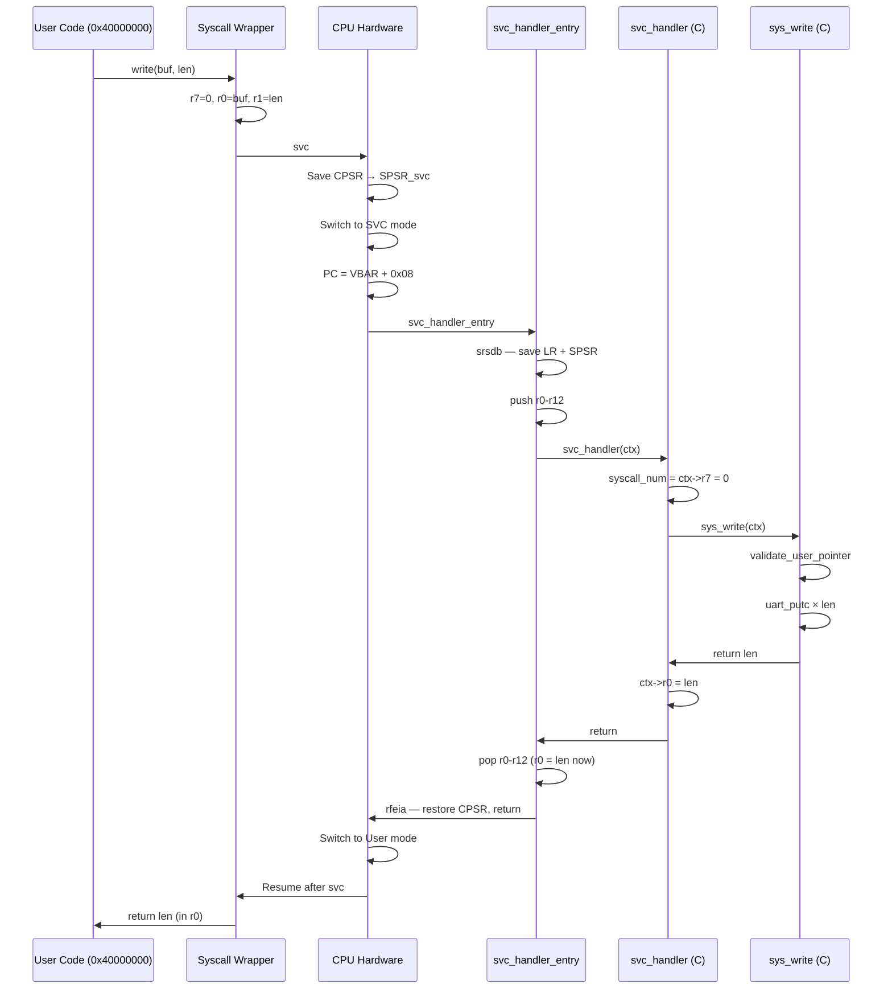

# 06 - System Call Mechanism

> **Phạm vi:** Toàn bộ syscall path — từ user-side wrapper → SVC exception → kernel dispatcher → implementation → return về user.
> **Yêu cầu trước:** [04-interrupt-and-exception.md](04-interrupt-and-exception.md) — SVC là 1 loại exception; [05-task-and-scheduler.md](05-task-and-scheduler.md) — `sys_yield()` gọi scheduler.
> **Files liên quan:** `vinix-kernel/include/syscalls.h`, `vinix-kernel/arch/arm/kernel/svc_handler.c`, `vinix-kernel/arch/arm/exceptions/exception_entry.S`, `userspace/lib/syscall.c`

---

## Syscall ABI

VinixOS dùng Linux ARM convention — syscall number trong `r7`, arguments trong `r0-r3`:

```
r7       = Syscall number
r0       = Argument 1 (và return value)
r1       = Argument 2
r2       = Argument 3
r3       = Argument 4
CPSR[I]  = clear (IRQ enabled) sau khi return
```

> **Tại sao r7 cho syscall number:** Không conflict với AAPCS argument registers (`r0-r3`). Consistent với Linux ARM ABI — familiar cho developers.

---

## Syscall Table

File: `VinixOS/vinix-kernel/include/syscalls.h`

| # | Tên | Arguments | Return | Mô Tả |
|---|-----|-----------|--------|-------|
| 0 | `SYS_WRITE` | `buf, len` | bytes written | Ghi ra UART |
| 1 | `SYS_EXIT` | `status` | không return | Terminate task |
| 2 | `SYS_YIELD` | — | `E_OK` | Nhường CPU |
| 3 | `SYS_READ` | `buf, len` | bytes read (0 = no data) | Non-blocking UART read |
| 4 | `SYS_GET_TASKS` | `buf, max_count` | task count | List running tasks |
| 5 | `SYS_GET_MEMINFO` | `buf` | `E_OK` | Memory info |
| 6 | `SYS_OPEN` | `path, flags` | fd (≥0) | Open file |
| 7 | `SYS_READ_FILE` | `fd, buf, len` | bytes read | Read from fd |
| 8 | `SYS_CLOSE` | `fd` | `E_OK` | Close fd |
| 9 | `SYS_LISTDIR` | `path, entries, max` | count | List directory |
| 10 | `SYS_EXEC` | `path` | — | Execute (future) |

---

## Error Codes

```c
#define E_OK     0    /* Success                */
#define E_FAIL  -1    /* Generic failure         */
#define E_INVAL -2    /* Invalid syscall number  */
#define E_ARG   -3    /* Invalid argument        */
#define E_PTR   -4    /* Invalid pointer         */
#define E_PERM  -5    /* Permission denied       */
#define E_NOENT -6    /* No such file            */
#define E_BADF  -7    /* Bad file descriptor     */
#define E_MFILE -8    /* Too many open files     */
```

**Convention:** Negative = error, zero/positive = success với value.

---

## User-side Syscall Wrappers

File: `VinixOS/userspace/lib/syscall.c`

Pattern chung — force compiler đặt values vào đúng registers:

```c
int write(const void *buf, uint32_t len) {
    register uint32_t r7  asm("r7") = SYS_WRITE;   /* Syscall number */
    register uint32_t r0  asm("r0") = (uint32_t)buf;
    register uint32_t r1  asm("r1") = len;
    register uint32_t ret asm("r0");

    asm volatile("svc #0"
        : "=r"(ret)
        : "r"(r7), "r"(r0), "r"(r1)
        : "memory");

    return ret;
}

void yield(void) {
    register uint32_t r7 asm("r7") = SYS_YIELD;
    asm volatile("svc #0" :: "r"(r7) : "memory");
}

int read(void *buf, uint32_t len) {
    register uint32_t r7  asm("r7") = SYS_READ;
    register uint32_t r0  asm("r0") = (uint32_t)buf;
    register uint32_t r1  asm("r1") = len;
    register uint32_t ret asm("r0");

    asm volatile("svc #0"
        : "=r"(ret)
        : "r"(r7), "r"(r0), "r"(r1)
        : "memory");

    return ret;
}
```

> **`"memory"` clobber:** Báo compiler syscall có thể đọc/ghi bất kỳ memory nào — ngăn compiler cache memory values qua SVC boundary.

> **`register ... asm("r7")`:** GCC register constraint — force bind C variable với physical register. Không có cách nào khác đảm bảo đúng ABI trong C.

---

## Kernel-side: SVC Entry

File: `vinix-kernel/arch/arm/exceptions/exception_entry.S`

```asm
svc_handler_entry:
    sub     lr, lr, #0              /* LR đã đúng (SVC không cần adjust)  */
    srsdb   sp!, #0x13              /* Save LR_svc + SPSR_svc lên SVC stack */
    push    {r0-r12, lr}            /* Save user registers                 */

    mov     r0, sp                  /* r0 = pointer đến saved frame        */
    bl      svc_handler             /* Call C dispatcher                   */

    pop     {r0-r12, lr}
    rfeia   sp!                     /* Restore CPSR, return to user        */
```

**Stack frame layout sau `push`:**

```
[high address]
    LR_svc       ← lr saved by push
    r12
    r11
    ...
    r1
    r0           ← sp points here (= struct svc_context *)
    SPSR_svc     ← saved by srsdb
    LR_svc       ← saved by srsdb
[low address / current SP]
```

### SVC Context Structure

File: `vinix-kernel/arch/arm/kernel/svc_handler.c`

```c
struct svc_context {
    uint32_t spsr;   /* Saved CPSR của user (mode, flags)   */
    uint32_t pad;    /* 8-byte alignment (AAPCS requirement) */
    uint32_t r0;     /* Argument 1 / Return value           */
    uint32_t r1;     /* Argument 2                          */
    uint32_t r2;     /* Argument 3                          */
    uint32_t r3;     /* Argument 4                          */
    uint32_t r4;  uint32_t r5;  uint32_t r6;
    uint32_t r7;     /* Syscall number                      */
    uint32_t r8;  uint32_t r9; uint32_t r10; uint32_t r11; uint32_t r12;
    uint32_t lr;     /* Return address trong user code       */
};
```

---

## Kernel-side: SVC Dispatcher

```c
void svc_handler(struct svc_context *ctx) {
    uint32_t syscall_num = ctx->r7;
    int32_t  result      = E_INVAL;

    switch (syscall_num) {
        case SYS_WRITE:     result = sys_write(ctx);    break;
        case SYS_EXIT:      result = sys_exit(ctx);     break;
        case SYS_YIELD:     result = sys_yield(ctx);    break;
        case SYS_READ:      result = sys_read(ctx);     break;
        case SYS_OPEN:      result = sys_open(ctx);     break;
        case SYS_READ_FILE: result = sys_read_file(ctx); break;
        case SYS_CLOSE:     result = sys_close(ctx);    break;
        case SYS_LISTDIR:   result = sys_listdir(ctx);  break;
        default:
            uart_printf("[SVC] Unknown syscall %d\n", syscall_num);
            result = E_INVAL;
    }

    /* Write return value vào r0 của user context */
    ctx->r0 = result;
}
```

> **Return value qua `ctx->r0`:** Kernel modify saved r0 trong stack frame. Khi `rfeia` return, register r0 được restore từ stack → user nhận return value mà không biết mechanism bên dưới.

---

## Syscall Implementations

### `sys_write` — với Pointer Validation

```c
static int32_t sys_write(struct svc_context *ctx) {
    const void *buf = (const void *)ctx->r0;
    uint32_t    len = ctx->r1;

    /* Validate user pointer — CRITICAL security check */
    if (validate_user_pointer(buf, len) != E_OK) return E_PTR;
    if (len > 256) return E_ARG;  /* Limit để tránh DoS */

    const char *str = (const char *)buf;
    for (uint32_t i = 0; i < len; i++) {
        if (str[i] == '\n') uart_putc('\r');  /* CR+LF */
        uart_putc(str[i]);
    }
    return (int32_t)len;
}

static int validate_user_pointer(const void *ptr, uint32_t len) {
    uint32_t start = (uint32_t)ptr;
    uint32_t end   = start + len;
    if (end < start) return E_PTR;  /* Overflow check */

    /* Must be entirely within User Space */
    if (start >= USER_SPACE_VA &&
        end   <= USER_SPACE_VA + (USER_SPACE_MB * 1024 * 1024))
        return E_OK;

    return E_PTR;
}
```

> ⚠️ **Pointer validation là critical security:** Không check → user có thể pass kernel pointer → đọc/ghi kernel memory. `validate_user_pointer()` phải được gọi cho MỌI pointer từ user space.

### `sys_yield` — Voluntary Preemption

```c
static int32_t sys_yield(struct svc_context *ctx) {
    extern volatile bool need_reschedule;
    need_reschedule = true;   /* PHẢI set trước khi gọi yield */
    scheduler_yield();
    return E_OK;
}
```

> **Phải set `need_reschedule = true` trước:** `scheduler_yield()` check flag trước khi switch. Nếu không set, yield bị ignore.

### `sys_read` — Non-blocking I/O

```c
static int32_t sys_read(struct svc_context *ctx) {
    void    *buf = (void *)ctx->r0;
    uint32_t len = ctx->r1;

    if (validate_user_pointer(buf, len) != E_OK) return E_PTR;
    if (len == 0) return 0;

    int c = uart_getc();  /* Non-blocking: return -1 nếu no data */
    if (c == -1) return 0;

    *(char *)buf = (char)c;
    return 1;
}
```

> **Non-blocking design:** Return 0 nếu không có data. User phải retry (với `yield()` để không busy-loop):
> ```c
> char c;
> while (read(&c, 1) == 0) yield();
> ```

### `sys_exit`

```c
static int32_t sys_exit(struct svc_context *ctx) {
    int32_t status = (int32_t)ctx->r0;
    struct task_struct *current = scheduler_current_task();
    uart_printf("[SVC] Task %d exiting with status %d\n", current->id, status);
    scheduler_terminate_task(current->id);   /* Mark ZOMBIE */
    return 0;  /* Not reached — scheduler switches away */
}
```

---

## Complete Syscall Flow



---

## Tóm Tắt

| Concept | Ý Nghĩa |
|---------|---------|
| SVC = Controlled Entry | User không thể jump trực tiếp vào kernel — chỉ qua SVC exception |
| r7 = Syscall Number | Linux ARM convention, không conflict với AAPCS argument registers |
| Pointer Validation | PHẢI validate mọi user pointer — prevent kernel memory access |
| `ctx->r0` = Return Value | Kernel modify saved register → user nhận kết quả khi return |
| Non-blocking I/O | `read()` return 0 nếu no data — user phải `yield()` và retry |
| Mode Switch Transparent | User chỉ thấy function call — không biết SVC exception bên dưới |
| Context pointer | SP sau push = `struct svc_context*` — C handler access tất cả registers |

---

## Xem Thêm

- [04-interrupt-and-exception.md](04-interrupt-and-exception.md) — SVC exception entry mechanism
- [08-userspace-application.md](08-userspace-application.md) — user-side syscall wrappers
