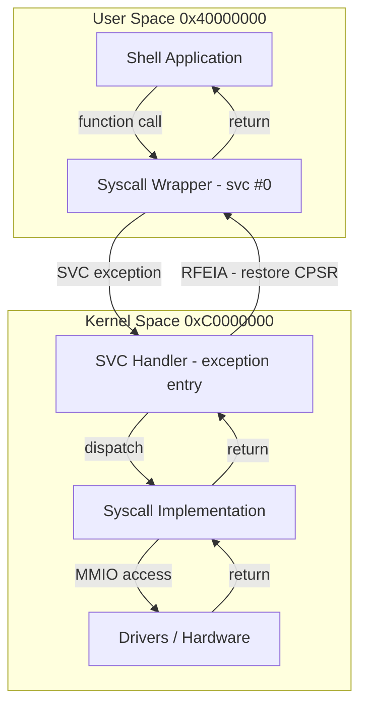

# 08 - Userspace Application

> **Phạm vi:** Môi trường userspace — runtime startup, linker script, syscall wrappers, shell application, và privilege separation giữa User Mode và Kernel Mode.
> **Yêu cầu trước:** [06-syscall-mechanism.md](06-syscall-mechanism.md)
> **Files liên quan:** `userspace/lib/crt0.S`, `userspace/linker/app.ld`, `userspace/lib/syscall.c`, `userspace/apps/shell/`

---

## Cấu Trúc Thư Mục

```text
VinixOS/userspace/
├── apps/
│   └── shell/
│       ├── shell.c      ← main loop, command dispatch
│       └── commands.c   ← ls, cat, ps, meminfo, help
├── lib/
│   ├── crt0.S           ← C runtime startup (entry point _start)
│   └── syscall.c        ← syscall wrappers (write, read, exit, yield...)
├── libc/
│   └── src/string.c     ← strlen, strcmp, strncmp, memcpy...
├── linker/
│   └── app.ld           ← linker script: base 0x40000000, stack 16KB
└── include/             ← shared headers
```

---

## Memory Layout

```text
User Space: 0x40000000 — 0x40FFFFFF (1MB total)

0x40000000  ┌─────────────────────┐
            │  .text  (code)      │  ← _start (crt0.S), sau đó main()
            │  .rodata            │  ← string literals, const data
            │  .data              │  ← initialized globals
            │  .bss               │  ← zero-initialized globals
            ├─────────────────────┤
            │  (unused)           │
0x400FC000  ├─────────────────────┤
            │  Stack (16KB)       │  ← grows DOWN ↓
            │  _stack_bottom      │
0x40100000  └─────────────────────┘  ← _stack_top (SP initial value)
```

> **Lưu ý:** Application được link cứng tại `0x40000000`. Kernel copy `shell.bin` vào đúng địa chỉ này lúc boot — không support Position-Independent Code (PIC).

---

## Runtime Startup — `crt0.S`

File: `VinixOS/userspace/lib/crt0.S`

```asm
.section .text.startup
.global _start

_start:
    /* 1. Setup stack pointer */
    ldr sp, =_stack_top          /* SP = 0x40100000 */

    /* 2. Zero-init BSS (C standard requirement) */
    ldr r0, =_bss_start
    ldr r1, =_bss_end
    mov r2, #0
1:  cmp  r0, r1
    strlo r2, [r0], #4
    blo  1b

    /* 3. Call application main() */
    bl main

    /* 4. Exit với return value từ main() (r0 không đổi) */
    mov r7, #1          /* SYS_EXIT */
    svc #0

    /* 5. Không bao giờ đến đây */
halt:
    b halt
```

| Bước | Ý nghĩa |
|------|---------|
| Setup SP | Load `_stack_top` từ linker symbol → stack sẵn trước khi gọi C code |
| Zero BSS | C standard yêu cầu uninitialized globals = 0 trước khi vào `main()` |
| `bl main` | Jump đến application `main()`. Return value sẽ ở `r0` |
| `svc #0` (exit) | Gọi `sys_exit(r0)` để terminate task — không return về kernel |

---

## Linker Script — `app.ld`

File: `VinixOS/userspace/linker/app.ld`

```ld
OUTPUT_FORMAT("elf32-littlearm")
OUTPUT_ARCH(arm)
ENTRY(_start)

MEMORY {
    USER_SPACE (rwx) : ORIGIN = 0x40000000, LENGTH = 1M
}

SECTIONS {
    . = 0x40000000;

    .text : {
        *(.text.startup)    /* crt0.S _start — phải đầu tiên */
        *(.text*)
    } > USER_SPACE

    .rodata : { *(.rodata*) } > USER_SPACE

    .data : {
        _data_start = .;
        *(.data*)
        _data_end = .;
    } > USER_SPACE

    .bss : {
        _bss_start = .;
        *(.bss*)
        *(COMMON)
        _bss_end = .;
    } > USER_SPACE

    /* Stack: 16KB tại cuối User Space */
    . = 0x40100000 - 0x4000;
    _stack_bottom = .;
    . = 0x40100000;
    _stack_top = .;
}
```

> ⚠️ **Quan trọng:** `.text.startup` phải được đặt đầu tiên trong `.text` — kernel jump đến `0x40000000` (entry point của `_start`). Nếu `_start` không ở offset 0, system sẽ execute sai code.

---

## Syscall Wrappers

File: `VinixOS/userspace/lib/syscall.c`

Pattern chung cho mọi wrapper — đặt syscall number vào `r7`, arguments vào `r0-r3`, rồi `svc #0`:

```c
int write(const void *buf, uint32_t len) {
    register uint32_t r7  asm("r7") = SYS_WRITE;
    register uint32_t r0  asm("r0") = (uint32_t)buf;
    register uint32_t r1  asm("r1") = len;
    register uint32_t ret asm("r0");

    asm volatile("svc #0"
        : "=r"(ret)
        : "r"(r7), "r"(r0), "r"(r1)
        : "memory");

    return ret;
}

void exit(int status) {
    register uint32_t r7 asm("r7") = SYS_EXIT;
    register uint32_t r0 asm("r0") = status;
    asm volatile("svc #0" :: "r"(r7), "r"(r0) : "memory");
    __builtin_unreachable();
}

void yield(void) {
    register uint32_t r7 asm("r7") = SYS_YIELD;
    asm volatile("svc #0" :: "r"(r7) : "memory");
}

int read(void *buf, uint32_t len) {
    register uint32_t r7  asm("r7") = SYS_READ;
    register uint32_t r0  asm("r0") = (uint32_t)buf;
    register uint32_t r1  asm("r1") = len;
    register uint32_t ret asm("r0");

    asm volatile("svc #0"
        : "=r"(ret)
        : "r"(r7), "r"(r0), "r"(r1)
        : "memory");

    return ret;
}
```

> **Tại sao inline assembly:** Compiler không thể guarantee đặt values vào đúng registers. Constraint `"r"(r7)` force compiler bind `r7` variable với physical register `r7`.

> **`"memory"` clobber:** Báo compiler rằng syscall có thể đọc/ghi memory tùy ý — ngăn compiler cache memory values qua SVC boundary.

---

## Shell Application

File: `VinixOS/userspace/apps/shell/shell.c`

### Main Loop

```c
int main(void) {
    char cmd_buf[128];
    write("\nVinixOS Shell\nType 'help' for commands\n\n", 40);

    while (1) {
        write("$ ", 2);

        /* Read command character by character */
        int cmd_len = 0;
        while (1) {
            char c;
            if (read(&c, 1) == 0) { yield(); continue; }  /* No data → yield */

            if (c == '\r' || c == '\n') { write("\n", 1); break; }

            if (c == '\b' || c == 0x7F) {   /* Backspace */
                if (cmd_len > 0) { cmd_len--; write("\b \b", 3); }
                continue;
            }

            if (cmd_len < (int)sizeof(cmd_buf) - 1) {
                cmd_buf[cmd_len++] = c;
                write(&c, 1);  /* Echo */
            }
        }
        cmd_buf[cmd_len] = '\0';
        if (cmd_len == 0) continue;

        /* Dispatch */
        if      (strcmp(cmd_buf, "help")   == 0) cmd_help();
        else if (strcmp(cmd_buf, "ls")     == 0) cmd_ls();
        else if (strncmp(cmd_buf, "cat ",4)== 0) cmd_cat(cmd_buf + 4);
        else if (strcmp(cmd_buf, "ps")     == 0) cmd_ps();
        else if (strcmp(cmd_buf, "meminfo")== 0) cmd_meminfo();
        else { write("Unknown command\n", 16); }
    }
    return 0;
}
```

> **Non-blocking I/O pattern:** `read()` return 0 nếu không có data. Shell phải gọi `yield()` để nhường CPU, tránh busy-loop chiếm 100% CPU time.

---

## Build Process

### Build Order (bắt buộc)

```text
Step 1: make -C VinixOS/userspace        → shell.bin
Step 2: make -C VinixOS/kernel           → kernel.bin (embed shell.bin)
```

> ⚠️ **Quan trọng:** Kernel Makefile gọi userspace build tự động nếu `shell.bin` chưa có. Nhưng nếu chỉ sửa userspace, phải build kernel lại để re-embed.

### Makefile Flags

```makefile
CC      = arm-none-eabi-gcc
CFLAGS  = -march=armv7-a -mfloat-abi=soft \
          -nostdlib -nostartfiles          \
          -I../include -I../libc/include
LDFLAGS = -T../linker/app.ld

OBJS = ../lib/crt0.o main.o commands.o ../lib/syscall.o ../libc/string.o

shell.elf: $(OBJS)
	$(LD) $(LDFLAGS) -o $@ $(OBJS)

shell.bin: shell.elf
	$(OBJCOPY) -O binary $< $@   # Strip ELF headers → raw binary
```

| Flag | Ý nghĩa |
|------|---------|
| `-nostdlib` | Không link glibc/newlib |
| `-nostartfiles` | Không dùng crt0 của toolchain — dùng `crt0.S` riêng |
| `-mfloat-abi=soft` | Software floating-point — Cortex-A8 không có VFP enabled |
| `-O binary` | objcopy strip ELF headers → raw binary, kernel `memcpy` trực tiếp |

### Embedding vào Kernel

File: `VinixOS/kernel/src/kernel/payload.S`

```asm
.section .rodata
.align 4

.global _shell_payload_start
.global _shell_payload_end

_shell_payload_start:
    .incbin "../../userspace/build/apps/shell/shell.bin"
_shell_payload_end:
```

Kernel_main() copy payload từ `.rodata` sang `0x40000000` lúc boot:

```c
uint8_t *src = &_shell_payload_start;
uint8_t *dst = (uint8_t *)USER_SPACE_VA;  /* 0x40000000 */
for (uint32_t i = 0; i < payload_size; i++)
    dst[i] = src[i];
```

> **Tại sao copy thay vì execute tại chỗ:** Payload nằm trong `.rodata` (read-only). Shell cần writable `.data` và `.bss` sections tại đúng địa chỉ. Copy sang `0x40000000` để layout khớp với linker script.

---

## Privilege Separation

| | User Mode (`CPSR = 0x10`) | Kernel Mode (`CPSR = 0x13` SVC) |
|---|---|---|
| **Memory access** | Chỉ User Space (0x40000000–0x40FFFFFF) | Toàn bộ memory map |
| **Peripheral regs** | ❌ Permission Fault | ✅ Trực tiếp qua MMIO |
| **CPSR modification** | ❌ Undefined Instruction | ✅ Được phép |
| **Privileged instrs** | ❌ MSR, MCR, MRC → fault | ✅ Được phép |
| **Kernel entry** | Chỉ qua `SVC #0` | Exceptions, IRQ |
| **Enforcement** | MMU (AP bits) + CPU mode | — |

### Boundary Enforcement



**3 lớp bảo vệ:**
1. **MMU:** User truy cập kernel VA → Permission Fault (AP=01)
2. **CPU mode bits:** User không thể self-elevate sang SVC mode
3. **SVC handler:** Duy nhất controlled entry point vào kernel — validate pointer trước khi dùng

---

## Tóm Tắt

| Concept | Ý Nghĩa |
|---------|---------|
| `crt0.S` | Setup SP + zero BSS + gọi `main()` + exit — không cần glibc startup |
| Linker script | Define load address `0x40000000`, stack 16KB, section layout |
| Syscall wrappers | Ẩn `SVC #0`, cung cấp C function interface — user code không cần biết ABI |
| Non-blocking I/O | `read()` return 0 nếu no data → shell `yield()` và retry |
| Binary embedding | Shell binary trong kernel `.rodata`, copy sang user space lúc boot |
| Privilege separation | MMU + CPU mode bits enforce user/kernel boundary — không thể bypass |
| `-nostdlib` | Không có malloc, printf, file I/O — tự implement hoặc dùng minimal libc |
| Fixed address | Application luôn load tại `0x40000000` — không support PIC |

---

## Xem Thêm

- [06-syscall-mechanism.md](06-syscall-mechanism.md) — kernel-side implementation của từng syscall
- [05-task-and-scheduler.md](05-task-and-scheduler.md) — shell chạy như một task trong scheduler
- [03-memory-and-mmu.md](03-memory-and-mmu.md) — memory layout và permission bits
